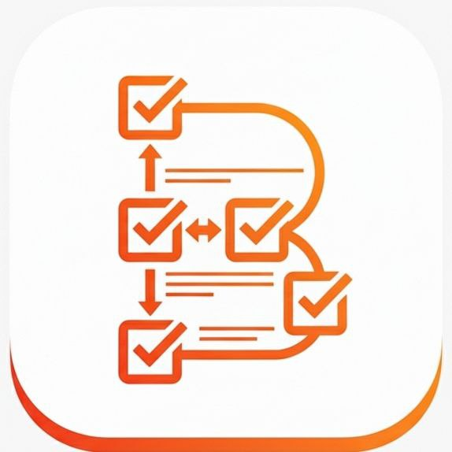

# B-List 🛒

<div align="center">
  
  
  ### Smart Shopping List Manager
  
  [](https://flutter.dev)
  [](https://firebase.google.com)
  [](LICENSE)
  
  ### 📥 [تحميل التطبيق (APK)](https://drive.google.com/drive/folders/1slXvKrSodil9Op9q1Ze6QxX-GBNJ7Z31)
</div>

---

## 📱 About The Project

**B-List** هو تطبيق ذكي لإدارة قوائم التسوق والمشتريات، تم تطويره بعناية لتسهيل عملية التسوق وتنظيم المشتريات بطريقة عصرية وفعالة.

التطبيق يوفر تجربة مستخدم سلسة ومتكاملة مع إمكانية المشاركة والتعاون بين عدة مستخدمين على نفس القائمة، مما يجعله مثالياً للعائلات والفرق.

---

## ✨ المميزات الرئيسية

- 🔐 **نظام مصادقة آمن**: تسجيل دخول باستخدام البريد الإلكتروني أو حساب Google
- 📝 **إنشاء قوائم متعددة**: أنشئ وأدر قوائم تسوق غير محدودة
- 👥 **المشاركة والتعاون**: شارك قوائمك مع أفراد العائلة أو الأصدقاء
- 🎨 **واجهة عصرية**: تصميم أنيق مع دعم الوضع الليلي والنهاري
- ☁️ **التخزين السحابي**: بياناتك آمنة ومتزامنة عبر جميع أجهزتك
- 👤 **ملف شخصي قابل للتخصيص**: اختر اسمك وصورتك الشخصية
- 📊 **إدارة ذكية**: تنظيم القوائم حسب الفئات والأولويات

---

## 🛠️ التقنيات المستخدمة

### Frontend
- **Flutter** - إطار عمل تطوير التطبيقات متعدد المنصات
- **Dart** - لغة البرمجة الأساسية

### Backend & Services
- **Firebase Authentication** - نظام المصادقة الآمن
- **Cloud Firestore** - قاعدة البيانات السحابية
- **Firebase Storage** - تخزين الملفات

### الحزم الرئيسية
```yaml
- firebase_auth: ^4.20.0
- cloud_firestore: ^4.17.5
- firebase_ui_auth: ^1.14.0
- google_sign_in: ^6.3.0
- shared_preferences: ^2.3.4
- google_fonts: ^6.2.1
```

---

## 🚀 البدء

### المتطلبات الأساسية
- Flutter SDK (3.0.0 أو أحدث)
- Dart SDK
- Android Studio / VS Code
- حساب Firebase

### خطوات التثبيت

1. **استنساخ المشروع**
```bash
git clone https://github.com/Osama7amed04/shopping_list_g2.git
cd shopping_list_g2
```

2. **تثبيت الحزم**
```bash
flutter pub get
```

3. **إعداد Firebase**
   - أنشئ مشروع جديد على [Firebase Console](https://console.firebase.google.com)
   - أضف تطبيق Android/iOS
   - حمّل ملف `google-services.json` في مجلد `android/app`
   - حمّل ملف `GoogleService-Info.plist` في مجلد `ios/Runner`

4. **تشغيل التطبيق**
```bash
flutter run
```

---

## 👥 فريق التطوير

تم تطوير هذا التطبيق كمشروع تخرج ضمن مبادرة **DEPI** - مسار Flutter Cross-Platform

### أعضاء الفريق :

- **ENG. Osama El-Kayyal**
- **ENG. Ahmed Hossam**
- **ENG. Mohamed El-Shamy**
- **ENG. Noran Mohamed**
- **ENG. Rana Mohamed**
- **ENG. Renad Emad**

---

## 📂 هيكل المشروع

```
lib/
├── main.dart                 # نقطة البدء الرئيسية
├── screens/                  # شاشات التطبيق
│   ├── Home.dart
│   ├── edit_profile.dart
│   ├── search_users_screen.dart
│   └── logout.dart
├── services/                 # خدمات Firebase
│   └── fire_store_services.dart
├── widgets/                  # المكونات القابلة لإعادة الاستخدام
├── utils/                    # الأدوات المساعدة
└── add_list/                 # شاشات إدارة القوائم
```

---

## 🔐 الأمان والخصوصية

- جميع البيانات مشفرة ومحمية عبر Firebase Security Rules
- المصادقة الثنائية متاحة
- لا يتم مشاركة البيانات الشخصية مع أطراف ثالثة
- التخزين السحابي الآمن لجميع المعلومات


## 🙏 شكر وتقدير

نتقدم بالشكر لكل من ساهم في إنجاح هذا المشروع:
- مبادرة **DEPI** لتوفير فرصة التعلم والتطوير
- جميع المدربين والموجهين على التوجيه القيم

---

<div align="center">
  <p>© 2025 B-List Team. All rights reserved.</p>
</div>
